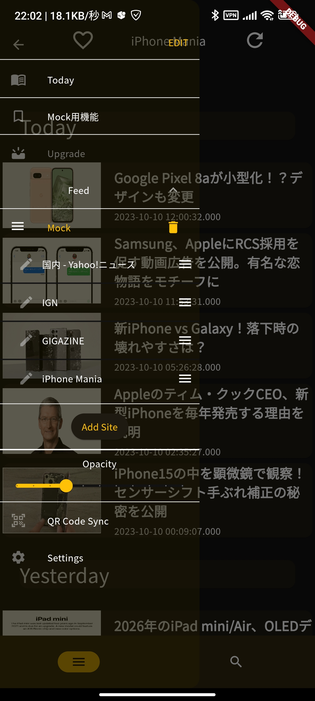
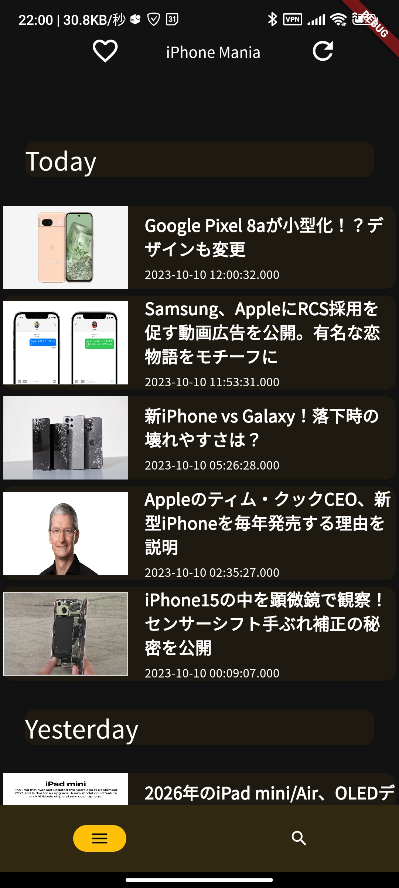
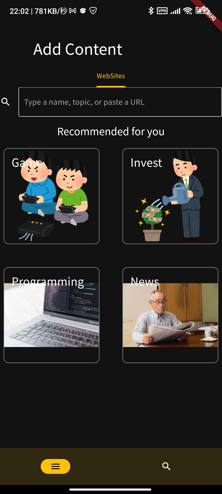

# feedays
RSSリーダーサービスのモバイルフロントエンドアプリケーションです
- IOS/Androidに対応・実機にて動作確認済み
# 使用技術
- 全体のアーキテクチャはClean Architectureを採用
  - DI・リポジトリパターン・UseCaseパターン・MVVMパターンを含んでいます
  - DIにより依存性の逆転をしており、これによりアプリのテスト・保守性を高めています
  - レイヤー間の依存関係は下記のようになっています
    - Presentation層 -> Domain層 -> Data層
- 状態管理はRiverPodを採用
- データ保存はHiveを採用
  - インターフェイスがシンプルであり、簡単にデータの永続化ができるため採用しました
  - ローカルに状態を保存して、ユーザーデータの永続化を実現
- レスポンシブデザインに対応
  - モバイル・タブレット端末のみならず、PCにも対応しています

# スクショ
## ハンバーガーメニュー画面

## 記事一覧画面

## 検索・サイト追加画面

